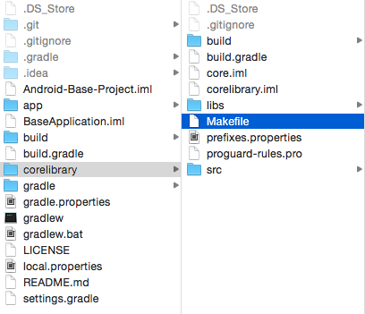

# Android-Base-Project

This is an Android base project template.

It has a dependancy on J2ObjC by Google which can be downloaded from here https://github.com/google/j2objc

After download the J2ObjC repo you will be able to run the make file that will transpile the source to Objective-C.

To run the make file you will need to open a terminal and go to the corelibrary folder inside the base project folder.

Then run the following command

make J2OBJC_HOME="path to J2ObjC folder/dist" IOS_PRJ_PATH="the path to ios project folder(this is where the output files will be placed)" IOS_PRJ_NAME="ios project name"
